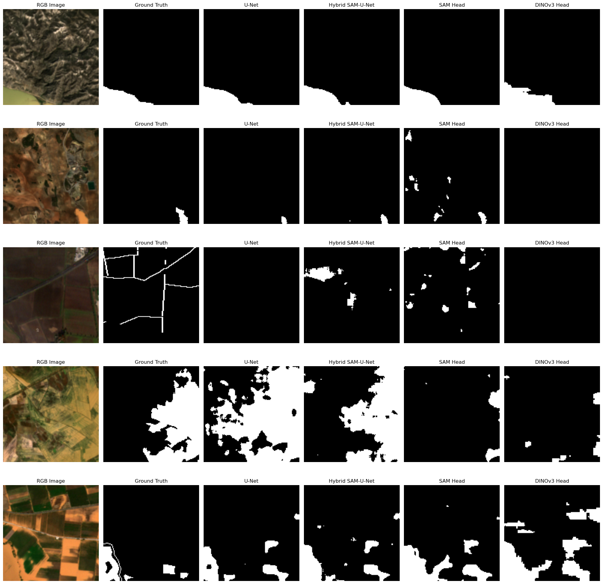
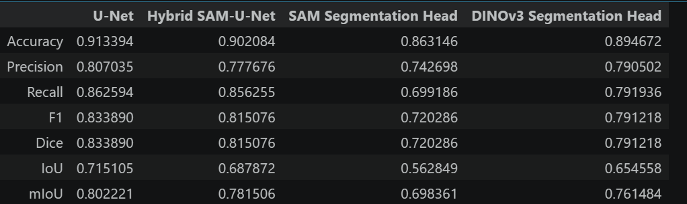

# Flood Segmentation using U-Net, SAM, and DINOv3

## Overview

This project explores flood segmentation from satellite imagery using deep learning and vision foundation models. The objective is to compare traditional semantic segmentation architectures with foundation-model-based approaches for accurate flood mapping.

The study evaluates four different models:

1. Baseline U-Net
2. Hybrid SAM-U-Net (SAM-enhanced bottleneck)
3. SAM Segmentation Head
4. DINOv3 Segmentation Head

All models are trained and evaluated on the STRUM Flood Dataset using Sentinel-2 optical imagery.

---

## Dataset

### STRUM Flood Dataset

The dataset contains:

- Sentinel-1 SAR images
- Sentinel-2 Multispectral images
- Flood masks

For this project:

- Only Sentinel-2 imagery was used
- Only RGB bands were utilized
- Images were resized to **128 × 128**
- Task: Binary Semantic Segmentation
  - Flood = 1
  - Non-Flood = 0

---

## Methodology

### 1. Baseline U-Net

A standard U-Net architecture was used as the baseline segmentation model.

**Pipeline**

RGB Image → Encoder → Bottleneck → Decoder → Flood Mask

---

### 2. Hybrid SAM-U-Net

The conventional U-Net bottleneck was replaced with frozen SAM feature embeddings.

**Pipeline**

RGB Image → U-Net Encoder → SAM Features → U-Net Decoder → Flood Mask

This approach investigates whether SAM representations can improve flood segmentation performance.

---

### 3. SAM Segmentation Head

Instead of using the full U-Net architecture, precomputed SAM embeddings were extracted and fed into a lightweight trainable segmentation head.

**Pipeline**

SAM Embedding → Segmentation Head → Flood Mask

Only the segmentation head is trained.

---

### 4. DINOv3 Segmentation Head

DINOv3 embeddings were extracted using a frozen DINOv3 Vision Transformer backbone.

A lightweight segmentation decoder was trained on top of the extracted embeddings.

**Pipeline**

DINOv3 Embedding → Segmentation Head → Flood Mask

Only the segmentation head is trained.

---

## Technologies Used

- Python
- PyTorch
- NumPy
- OpenCV
- Matplotlib
- Segment Anything Model (SAM)
- DINOv3
- Jupyter Notebook

---

## Evaluation Metrics

The following metrics were used for model comparison:

- Accuracy
- Precision
- Recall
- F1 Score
- Dice Score
- Intersection over Union (IoU)
- Mean IoU (mIoU)

---

## Results

### Quantitative Comparison

| Metric | U-Net | Hybrid SAM-U-Net | SAM Segmentation Head | DINOv3 Segmentation Head |
|----------|----------:|----------:|----------:|----------:|
| Accuracy | 0.9134 | 0.9021 | 0.8631 | 0.8947 |
| Precision | 0.8070 | 0.7777 | 0.7427 | 0.7905 |
| Recall | 0.8626 | 0.8563 | 0.6992 | 0.7919 |
| F1 Score | 0.8339 | 0.8151 | 0.7203 | 0.7912 |
| Dice Score | 0.8339 | 0.8151 | 0.7203 | 0.7912 |
| IoU | 0.7151 | 0.6879 | 0.5628 | 0.6546 |
| mIoU | 0.8022 | 0.7815 | 0.6984 | 0.7615 |

---

### Prediction Comparison

The following figure compares segmentation outputs from all four models.



---

### Metrics Comparison


---

## Key Findings

- The baseline U-Net achieved the highest overall performance across most evaluation metrics.
- Replacing the U-Net bottleneck with SAM features did not improve segmentation performance on the STRUM flood dataset.
- The standalone SAM Segmentation Head showed weaker performance compared to U-Net-based architectures.
- The DINOv3 Segmentation Head performed significantly better than the SAM Segmentation Head and approached the performance of the baseline U-Net.
- Foundation model embeddings contain useful flood-related representations, but further fine-tuning and architectural improvements may be required to outperform conventional U-Net models.

---

## Repository Structure

```text
├── notebooks/
│   ├── baseline_unet.ipynb
│   ├── hybrid_sam_unet.ipynb
│   ├── sam_segmentation_head.ipynb
│   ├── dinov3_segmentation_head.ipynb
│   └── evaluation.ipynb
│
├── checkpoints/
│   ├── best_unet.pth
│   ├── best_hybrid.pth
│   ├── best_sam_head.pth
│   └── best_dinov3_head.pth
│
├── results/
│   ├── prediction_comparison.png
│   └── metrics_table.png
│
└── README.md
```

---

## Future Work

- Utilize all Sentinel-2 spectral bands instead of only RGB.
- Explore Sentinel-1 and Sentinel-2 multimodal fusion.
- Fine-tune foundation models instead of using frozen embeddings.
- Investigate advanced decoder architectures for improved segmentation quality.
- Extend evaluation to additional remote sensing flood datasets.

---

